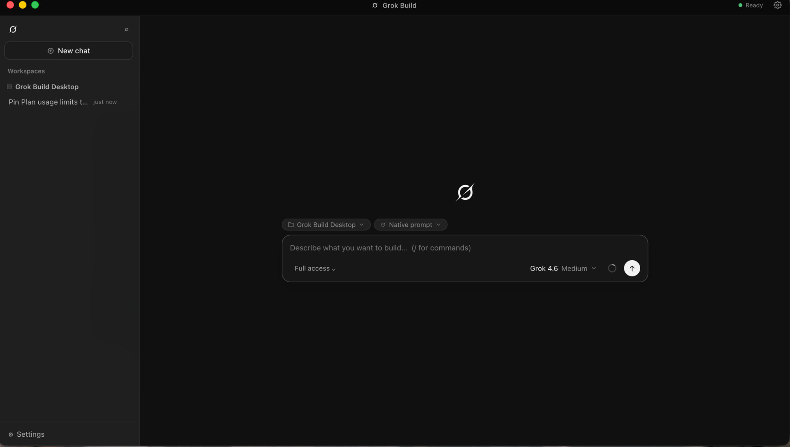
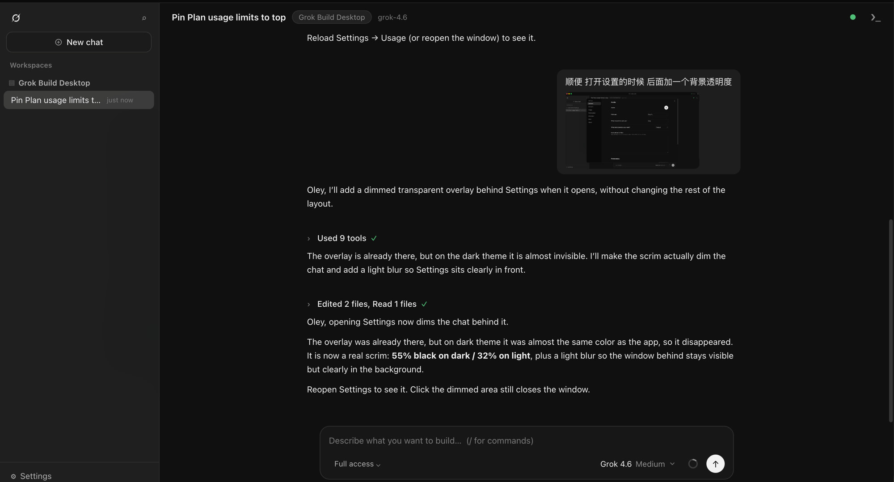

<h1>
  <picture>
    <source media="(prefers-color-scheme: dark)" srcset="docs/grok-mark-white.svg">
    <source media="(prefers-color-scheme: light)" srcset="docs/grok-mark-black.svg">
    
  </picture>
   
  Grok Build Desktop (<code>not official</code>)
</h1>

A macOS window for [Grok Build](https://x.ai/cli) — the same `grok`, the same sessions, without the TUI.
An independent project, not a SpaceXAI or xAI app.

---

## Get started

1. Install and sign in to [Grok Build](https://x.ai/cli) (`grok`) on this Mac.
2. Download the DMG from [Releases](https://github.com/oleyyu/grok-build-desktop/releases) — Apple silicon or Intel — and drag the app to Applications.
3. First open: right-click the app → **Open**. It is signed but not notarized, so macOS warns once.

From source: double-click `启动 Grok Build.command`. The first launch downloads the desktop runtime into a local cache.

Chats in the sidebar are the sessions in `~/.grok/sessions` — start one in the terminal, continue it in the app, and back again.

## What you get

- One input on the home screen: pick a folder and a prompt style, then chat.
- The same models and effort levels as Grok, including Grok 4.6.
- Permission modes: ask every time, auto-allow reads, or full access.
- Slash commands with `/`, images pasted into a message, usage and activity in Settings.
- A button to reopen the current chat in the real `grok` TUI.
- The Mac stays awake while a turn is running, even with the display off. Closing the lid still pauses it.

## Computer use

Settings → Permissions → **Computer use**. Grok gets its own purple pointer and drives **one window at a time**: it screenshots that window and clicks through macOS accessibility, so your cursor never moves and your keystrokes stay where you are typing. A *"Grok is working on your Mac."* banner floats on top — visible to you, never inside Grok's own screenshots.

Requires Screen Recording and Accessibility granted to whatever launched the app (usually Terminal). Use Grok 4.6.

Rather than reading coordinates off a screenshot, Grok asks the window for a numbered list of its buttons, fields and links and presses one by number — so a window that moved or scrolled between looking and clicking no longer causes a misplaced click.

**Limits:** no right-click menus; fallback clicks and drags cannot be confirmed; a window on another desktop stays clickable but cannot be inspected. Set `engine.cuGhost: false` in `home/settings.yaml` for the shared-cursor mode — real cursor, whole screen, pauses the moment you switch desktops — which is the one to use when you need a right-click or a guaranteed drag.

## Settings

Theme, language, profile, usage, account and providers live in the gear; file-level preferences in `home/settings.yaml`. API keys go to `~/Library/Application Support/Grok Build Desktop/.credentials.yaml` (mode 0600), deliberately outside the folder you sync or screenshot. Grok's own login stays in `~/.grok`; Settings → Account holds more than one account and switches when the current one hits its limit.

Drop your own prompts as `.md` into `home/prompts/` — the first `# heading` becomes the name in the menu.

## Thanks

To [DeepSeek Harness](https://github.com/deepseek-ai/deepseek-harness) and [Grok Build](https://github.com/xai-org/grok-build) for opening their work on GitHub. This app stands on that.

## License

[MIT](LICENSE). Copyright (c) 2026 Oley Yu.
